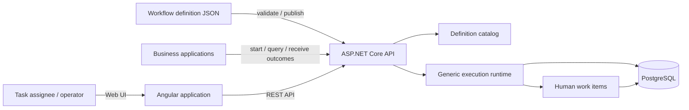

# Workflow Engine Architecture

**Status:** Target architecture for a general-purpose, definition-driven workflow runtime. The current code is still a purchase-specific vertical slice and has not reached this design.

## Architectural goal

Let teams define and run different business processes without changing or redeploying engine code. A definition declares input data, executable steps, routing, and output mapping. A host application starts and queries instances through a REST API; people act on assigned work through the operations interface. The runtime persists progress so an instance can wait for a human or durable background work without holding an HTTP request or relying on process memory.

## Shape

The initial deployment remains a modular monolith: one backend application, one relational database, and one Angular application. General-purpose refers to the processes the runtime can define and execute; it does not require a distributed microservice architecture.

## Domain modules

- **Workflow Definitions:** validated, immutable revisions containing input/output contracts, supported steps, and transition rules.
- **Workflow Execution:** generic instance lifecycle, step execution, deterministic routing, variable/data context, and durable progress.
- **Human Work:** generic user tasks, assignment, completion payloads, and authorization. Approval is one task pattern.
- **Workers and Actions:** bounded, registered action types for external work, with durable attempts and retries. Arbitrary code from a definition is never executed.
- **Execution History:** append-only facts describing execution and state changes, committed consistently with those changes.
- **HTTP API:** versioned integration surface to manage definitions, start/query instances, and complete assigned work.
- **Identity boundary:** validate host-issued JWT bearer tokens and authorize access using authenticated identity and definition policy. Local demo identity is development-only.

These are domain boundaries, not a commitment to one project per module. They can share a process and database while ownership remains clear.

## Execution path

1. An administrator publishes a validated immutable definition revision.
2. A host application starts a named workflow with JSON input and an idempotency key; the runtime validates input against the definition contract.
3. The runtime pins the instance to that revision and advances through supported steps, evaluating declared routes against instance data.
4. At a wait point such as a user task or durable action, it commits progress and history, then releases execution capacity.
5. A task completion or action result resumes the instance. The engine validates the payload and advances according to the same pinned definition.
6. An end step writes the definition-selected outcome and output data for retrieval or delivery to the host application.

The engine must not run arbitrary scripts supplied in definitions. Conditions and mappings use a bounded, versioned expression model. Durable workers, retries, timers, and parallel execution are introduced in stages with explicit persistence and delivery semantics; they must not be simulated by long-running HTTP requests.

## Persistence and correctness

PostgreSQL is the durable source of truth for definition revisions, workflow instances, step executions, human work items, action attempts, and execution history. EF Core is the persistence boundary for the current stack.

Every instance references one immutable definition revision. A state transition, associated task/action update, and its history record must commit consistently. Start and completion commands are idempotent where retries may occur. Concurrent commands must not overwrite one another. These guarantees belong in database constraints and concurrency-aware application logic, not UI assumptions.

The model stores current instance state for efficient reads and keeps append-only execution history. It is not required to reconstruct every read by replaying an event-sourced log.

## Interfaces and deployment

- **External applications:** REST API to publish definitions, start/query instances, and obtain outputs.
- **People:** Angular UI for assigned work items, instance details, and execution history.
- **Storage:** PostgreSQL for durable definitions and runtime state.
- **Deployment:** self-hosted modular monolith, initially packaged with Docker Compose on a single host.

Identity provisioning, provider-specific SSO, multi-tenancy, a broad connector catalog, and high availability require separate validated scope. External callbacks should use a transactional outbox once introduced.

## Staged capability boundary

- **Generic runtime foundation:** versioned JSON definitions, typed JSON input/output, start/end, user-task, variable assignment, and exclusive conditional routing. Definitions are authored and published through an API. The purchase flow is a sample.
- **Durable integration:** registered service actions, durable worker queue, bounded retries, and an outbox for callbacks/webhooks.
- **Later, driven by concrete use cases:** timers, parallel branches and joins, cancellation/compensation, and visual authoring.

Each stage must keep definitions portable, execution history explainable, and active instances pinned to immutable revisions. See [ADR 0006](decisions/0006-definition-driven-general-purpose-runtime.md).
