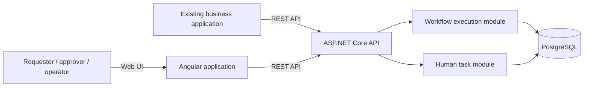

# Initial Architecture

**Status:** Proposed architecture for the MVP; it should change when a concrete requirement disproves an assumption.

## Architectural goal

Run the purchase-approval lifecycle as one self-hostable application. A host application starts and queries requests through a REST API; an operator uses the Angular interface to act on approval tasks and inspect execution history. The runtime persists progress so a workflow can wait for a human without keeping an HTTP request or process memory alive.

## Shape

The initial deployment is a modular monolith: one backend application, one relational database, and one Angular application. Domain boundaries remain explicit in code while the runtime stays simple to build, run, debug, and deploy.

## Proposed modules

- **Workflow Definitions:** published definition revisions and the input/step/transition rules needed to start new instances.
- **Workflow Execution:** instance lifecycle, step execution, deterministic routing, and durable progress.
- **Human Tasks:** approval assignment, pending work, authorization of a decision, and task completion.
- **Execution History:** the recorded facts operators use to understand what happened. It is written consistently with the state changes it describes; it is not a separate event-sourced platform.
- **HTTP API:** versioned integration surface for starting workflows, querying requests, and completing assigned approvals.
- **Identity boundary:** validate host-issued JWT bearer tokens in non-development environments and match the authenticated subject to the assigned approver. Local demo identity is development-only.

These are domain boundaries, not a commitment to one project-per-module layout. They may share a process and database while ownership remains clear.

## Execution path

1. A host application submits a purchase request and an idempotency key to the API.
2. The API validates the request and creates an instance pinned to a published definition revision.
3. The runtime evaluates the simple amount threshold and either completes the policy path or creates an approval task.
4. For an approval path, the runtime persists the waiting instance, open task, and history. The HTTP request ends.
5. The assigned approver submits a decision through the UI/API. The runtime validates assignment and current task state, then persists the decision and resulting transition atomically.
6. The host application queries the request outcome through the API.

The MVP has no long-running in-memory workflow execution. It also does not need a general background scheduler while the supported process contains no timers or asynchronous external actions.

## Persistence and correctness

PostgreSQL is the durable source of truth for definition revisions, workflow instances, approval tasks, and execution history. EF Core is the persistence boundary selected for the implementation stack.

The state transition, task decision, and corresponding history record must commit consistently. A repeated start with the same actor, idempotency key, and normalized request content must resolve to the same instance; reusing a key for different content or another actor returns a conflict. Concurrent decisions must not overwrite one another. These guarantees should be enforced by database constraints and concurrency-aware application logic, not by assumptions in the UI.

The model stores current instance state for efficient reads and keeps an append-only history of meaningful transitions. It does not reconstruct all current state by replaying an event log.

## Interfaces and deployment

- **External application:** REST API to start and query an instance.
- **People:** Angular UI for pending approvals, request details, and execution history.
- **Storage:** PostgreSQL for durable process state.
- **Deployment:** one self-hosted installation for one organization in the MVP. The first packaged deployment uses Docker Compose on a single host.

An outbound webhook, vendor-specific connectors, user provisioning, provider-specific SSO, and multi-tenancy are deferred. The API query is sufficient to demonstrate the initial handoff and retrieve the outcome; callback delivery can be added when a validated integration needs it.

## Why not distribute the first version?

The state transition, approval task, and execution history form one consistency boundary in the first use case. Separating services now would add network and deployment failure modes before there is evidence that independent scaling or ownership is needed. A message broker is also unnecessary while every supported transition can complete synchronously within the API command and no scheduled work exists.

Reconsider distribution only when a module has a real independent scaling, availability, deployment, or ownership requirement that outweighs the additional consistency and operations cost.

## Deferred architecture questions

- How workflow-definition revisions are published and retained after the seeded MVP definition.
- Whether outbound webhooks become a core integration path and require a transactional outbox.
- Whether a durable job worker becomes necessary when external actions, timers, or retries enter scope.
- How definition revisions are published and retained after active instances finish.
